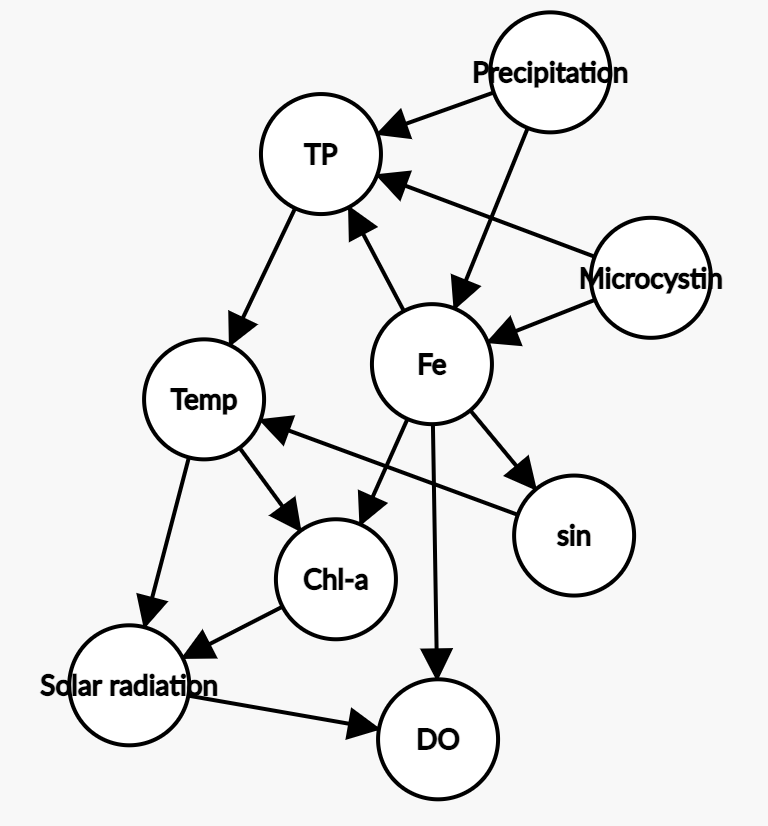
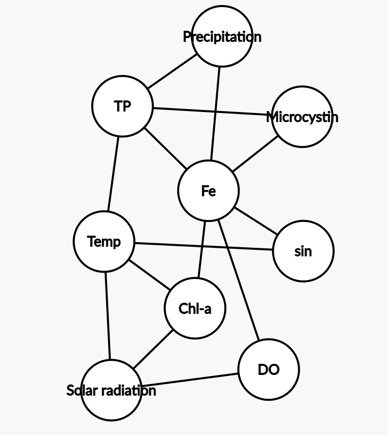
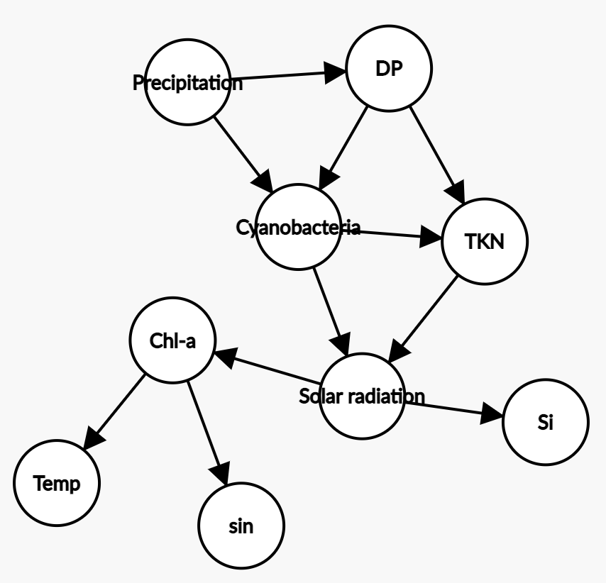

# Predicting cyanobacterial blooms and toxins using Bayesian Belief Networks
## Study site: Cheney Reservoir
- Large, shallow
- Eutrophic(average TP=100 µg/L)
- Cynobacteria-caused taste and odor and toxin events since 1990
## Solar and precipitation data
The data is from [**NASA Prediction Of Worldwide Energy Resources (POWER) Project**](https://power.larc.nasa.gov/). The Power Project contains Near Real Time(NRT) satellite-derived meterorology and solar energy data. 
All Sky Insolation Incident on a Horizontal Surface: The average amount of the total solar radiation incident on a horizontal surface at the surface of the earth. The unit is MJ/m^2/day.
## Data set:
- May 2001 to June 2015
- Collected at the surface(0.5m) with Kemmerer sampler from May 2001 to July 2004. Vertical integrated photic zone samples were collected from August 2004 to June 2015.
- Geosmin: GC-MS
- Microcystin: ELISA
- Phytoplankton: membrane filtered slies
## Data cleaning:
- Originally more than 100 physiochemical water quality variables were measured.
- Avoid collinearity: correlation greater than abs 0.75 were removed
- Explanatory variables with >5% of the observations missing were excluded
- Variables and response with concentrations less than the analytical limit of detection were substituted with a value half of the limit of detection
- Seasonality is an explanatory variable –Fourier transformed the data variable (i.e. sin and cos)
- 24 potential variables left
Harris's paper ranked the 20 most important variables for predicting cyanobacteria, geosmin, microcystin using SVM, RF, BT, Cubist modeling. I selected the top 6~7 variables as well as solar radiation and precipitation for each model to avoid long operation time.
## Variables:
- Temp : Temperature
- TP: Total Phosphorus
- Fe: Iron (µg/L)
- DO: Dissolved oxygen (mg/L)
- Chl-a: Chlorophyll a(µg/L)
- TKN: Total Kjeldahl nitrogen(mg/L as N)
- SSC: Suspended sediment concentration(mg/L)
- Si: Silica(mg/L as SiO2)
- DP: Dissolved phosphorus(mg/L as P)
- NO: Nitrate plus nitrite(mg/L as N)
- ALLSKY_SFC_SW_DWN: All Sky Insolation Incident on a Horizontal Surface (MJ/m^2/day)
- PRECTOT: Precipitation (mm/day)
## Model Structure
Pgmpy score-based structure learning is very slow working with large(150 rows) data. I randomly sampled 20% data and used Hill Climbing search. The following are the learned structures. Constraint-based structure learning and other library can be tried later.
- Microcystin: 

- Geosmin: 

- Cyanobacteria: 

## Parameter
Used maximum likelihood estimator, which may cause overfitting. I will try Bayesian estimator later.
## Inference:
- MAP inference:
I used belief propapgation method, but the evidence needs to be integer. I'm thinking about converting the Bayesian network to Markov and factor graph and using Max-Product algorithm. Still working on the pgmpy documents for the solution to deal with continuous variables.
- Marginal probability distribution
## Reference
[1]pgmpy library: https://pgmpy.org/index.html
[2]Ankan, A., & Panda, A. (2015). pgmpy: Probabilistic graphical models using python. In Proceedings of the 14th Python in Science Conference (SCIPY 2015). Citeseer (Vol. 10).
[3]Koller, D., & Friedman, N. (2009). Probabilistic graphical models: principles and techniques. MIT press.
[4]Bishop, C. M. (2006). Pattern recognition and machine learning. springer.
